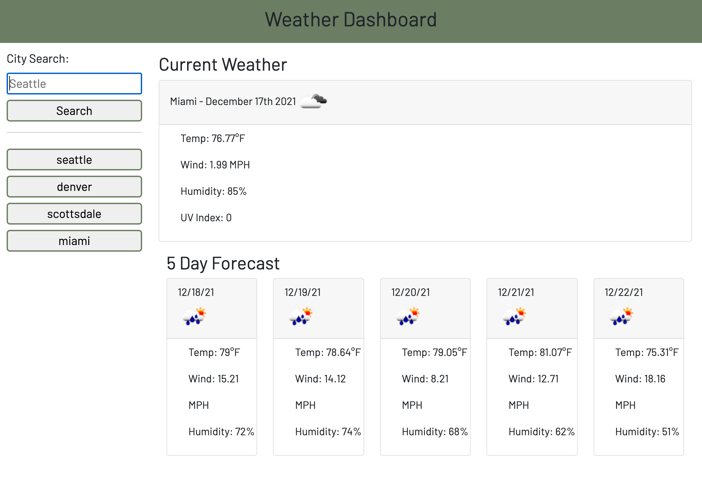

# weather-dashboard

This weather dashboard allows a user to simply type in any city and the webage will show the current conditions including the temperature, wind, humidity, uv index, and an icon showing the current conditions.

Below the user can also find a 5 day forecast with the same information. On the left side-bar, the users previous searches will show up so that they can easily go back and view a city they commonly search for.

**Link to Webpage**

https://mkimborowicz.github.io/weather-dashboard/

**Screenshot of Webpage**

